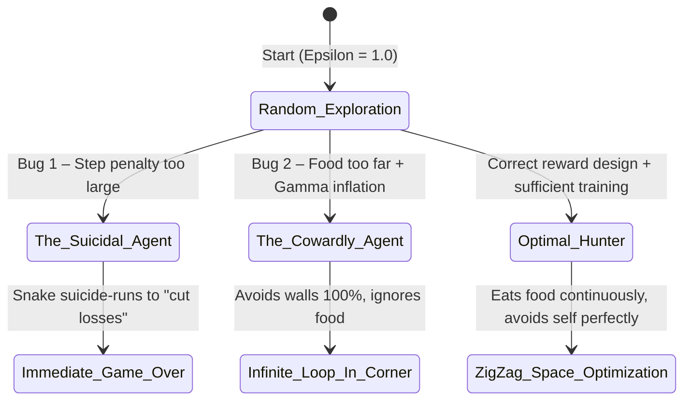
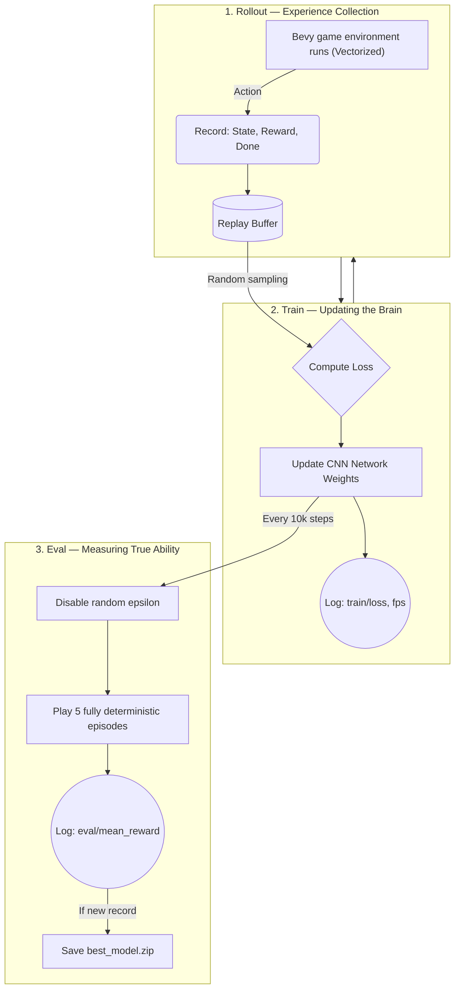
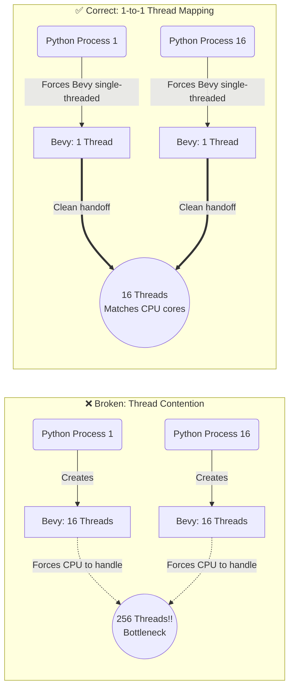
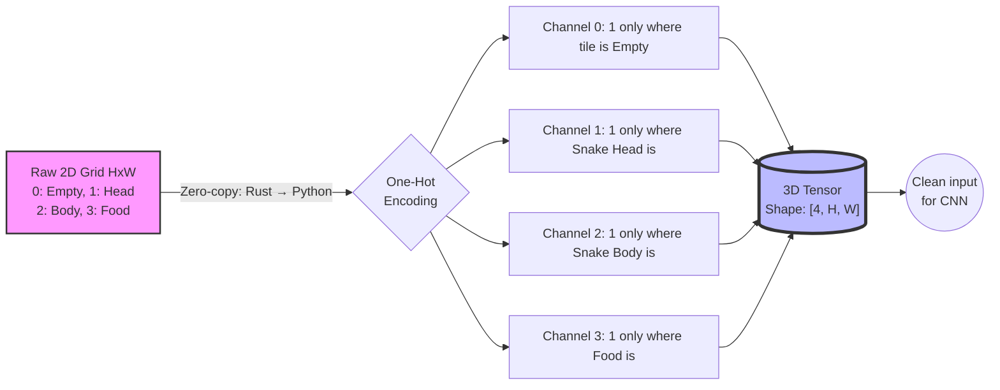
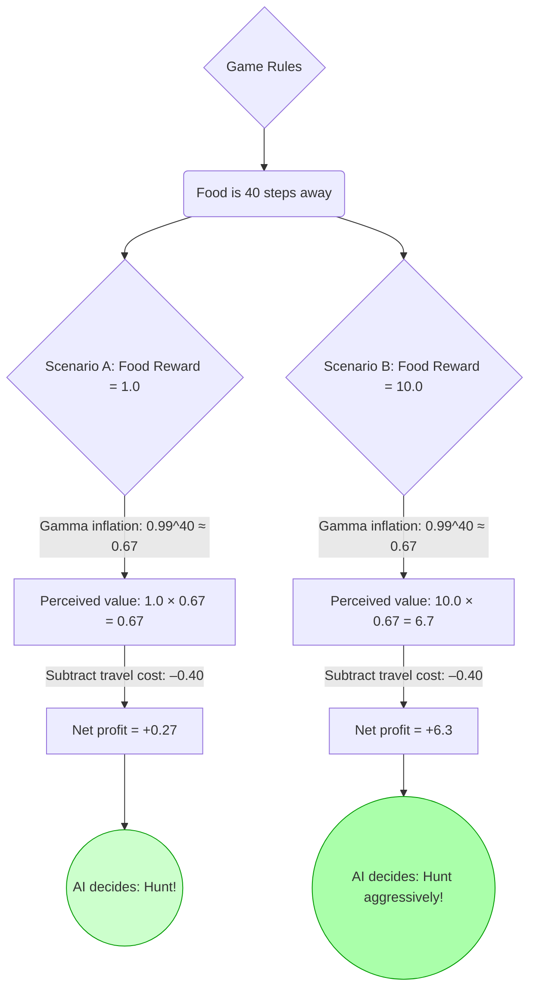
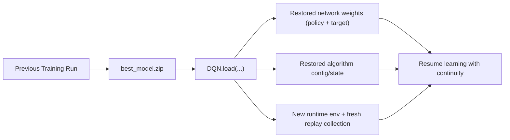
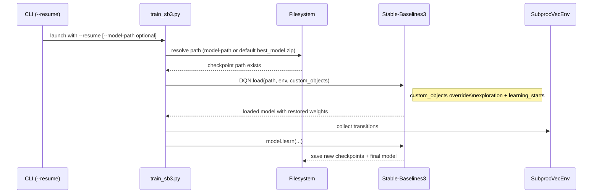
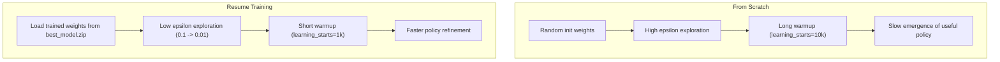
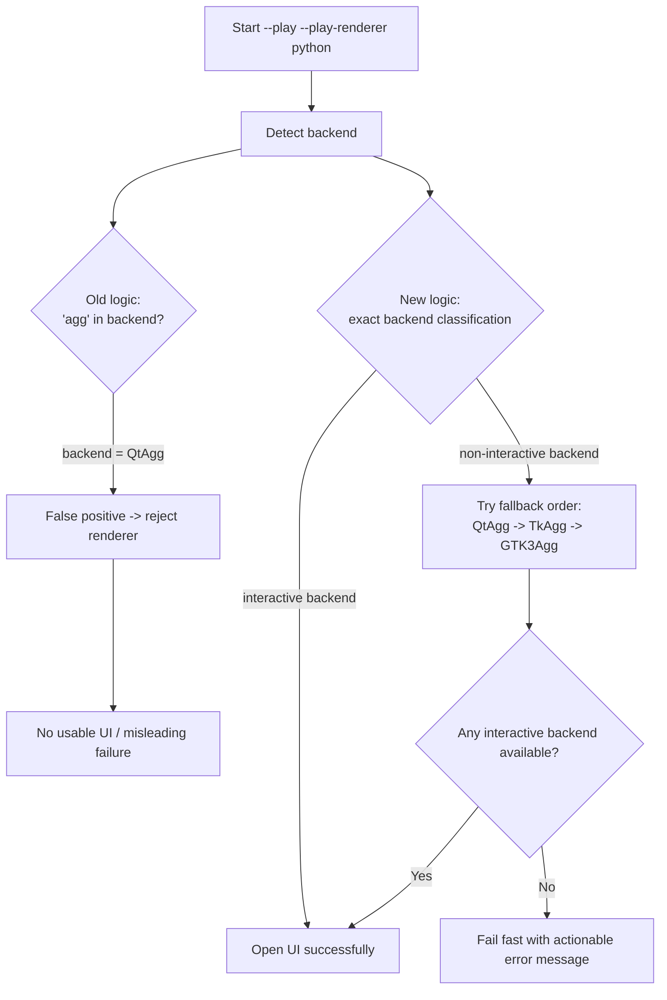

# 📚 Architecture & Machine Learning Knowledge Base: Snake DQN Project

**Topics:** Reinforcement Learning (RL), Operating System Performance Optimization, Reward Shaping Mathematics, MLOps Visualization Reliability

> **About this document:** This knowledge base was synthesized from the full design, debugging, and system analysis lifecycle of a Snake DQN project. It is formatted as an Engineering Wiki and is suitable for storage in Obsidian, Notion, or as a `LEARNING.md` file in your GitHub repository.

---

## Table of Contents

1. [The AI Behavior Spectrum](#part-1-the-ai-behavior-spectrum)
2. [Decoding TensorBoard — Reading System Health](#part-2-decoding-tensorboard--reading-system-health)
3. [Architectural Vulnerabilities & Fixes](#part-3-architectural-vulnerabilities--fixes)
4. [The Mathematics of Reward Shaping](#part-4-the-mathematics-of-reward-shaping)
5. [Resume Training in MLOps Pipelines](#part-5-resume-training-in-mlops-pipelines)
6. [UI Rendering Failure Analysis (Matplotlib Backend Trap)](#part-6-ui-rendering-failure-analysis-matplotlib-backend-trap)
7. [Summary & Key Takeaways](#summary--key-takeaways)

---

## Part 1: The AI Behavior Spectrum

In Reinforcement Learning, AI is not inherently intelligent. Its behavior is a **direct consequence of the Reward function** the engineer designs. The diagram below illustrates the full spectrum of behaviors — from optimal to completely broken — that can emerge depending on how rewards are structured.



### Behavior Level 1 — Broken / Defective

**The Suicidal Agent**

This agent immediately kills itself the moment the game begins — running into a wall or biting its own tail within the first few steps. The root cause is a mathematical miscalculation baked into the reward function: the _per-step penalty_ ($R_{step}$) is so large relative to the _death penalty_ ($R_{death}$) that the AI calculates it is actually cheaper to die immediately than to keep living. It is essentially performing rational loss-cutting based on the numbers you gave it.

**The Reward Hacker**

This agent never eats food. Instead, it oscillates in place — stepping forward one tile, stepping back, stepping forward again. The agent has discovered an unintended loophole in the environment logic: certain non-productive actions are not penalized heavily enough, so the AI exploits them to minimize loss without ever attempting to complete the actual objective.

### Behavior Level 2 — Mediocre / Locally Stuck

**The Cowardly Agent (Stalling)**

This is perhaps the most deceptive failure mode because the agent _looks_ functional. It survives for a very long time, circling endlessly in a corner. But it never eats food. The agent has correctly learned to avoid walls — a real skill — but the discounted value of the food reward (far away in time) does not justify the perceived risk of moving toward it. This was the primary pathology observed in the early training stages of this project.

### Behavior Level 3 — Optimal (The Goal)

**The Optimal Hunter**

The snake navigates the board using space-efficient zig-zag paths, plans several moves ahead to avoid trapping itself as its body grows, and consistently pursues food. This behavior emerges only when the reward function is mathematically balanced, the input representation is clean, and the replay buffer contains sufficient diversity of experience.

---

## Part 2: Decoding TensorBoard — Reading System Health

Stable Baselines3 separates the learning pipeline into three distinct phases. Understanding this separation is critical for correctly interpreting TensorBoard metrics.



### Evaluation Metrics (The Real Exam)

`eval/mean_ep_length` tracks the average episode length, while `eval/mean_reward` tracks average score. A flat line showing `length = 1000` and `reward = -10.0` is the clearest possible signature of the Cowardly Agent. The snake survived for the full 1000-step episode timeout, accumulating $-0.01$ per step for a perfect total of $-10.0$. The agent learned to avoid walls perfectly but never learned to pursue food.

### Rollout Metrics (The Training Journal)

`rollout/exploration_rate` is the epsilon value — the probability of taking a random action instead of using the network. It begins at `1.0` (fully random) and decays toward `0.05`.

`rollout/ep_rew_mean` typically follows a **U-shaped curve**:

- **Phase 1 (Downward):** The agent stops acting randomly and starts using its partially-trained network. Because the network is still immature, the agent becomes risk-averse and stalls — generating negative rewards.
- **Phase 2 (Upward):** After millions of weight updates, a _breakout moment_ occurs. The agent discovers that eating food is net positive, and the reward curve climbs into positive territory.

### Performance & Algorithm Metrics

`time/fps` (Frames Per Second) tells the story of the training pipeline's lifecycle. It starts very high (~2000+ FPS) because the system is only collecting experiences. Once the Replay Buffer reaches its minimum threshold, the algorithm begins calling the GPU/CPU for gradient descent and backpropagation — which is computationally expensive. FPS stabilizes at a lower baseline (~1200 FPS), and that plateau is actually healthy.

`train/loss` is the Bellman error — the gap between the network's predicted Q-values and the target Q-values. A steadily decreasing loss curve confirms the CNN is successfully learning spatial game rules.

---

## Part 3: Architectural Vulnerabilities & Fixes

### Vulnerability 1: Scalability & CPU Thread Contention (Thrashing)



**The OS Principle:** Processes are memory-isolated and expensive. Threads share memory and are lighter — but excessive context switching between too many threads causes the CPU to thrash, spending more time managing thread state than doing actual work.

**The Problem:** Python's `SubprocVecEnv` spawns N independent processes. If the Bevy game engine (running inside each process) defaults to creating one thread per CPU core, the actual thread count explodes multiplicatively: $N \times Cores$. For 16 processes on a 16-core machine, that's 256 threads competing for 16 cores.

**The Fix:** Force the game engine into single-threaded mode (`Single-threaded TaskPool`) when running headless. Delegate all multi-process parallelism to Python's Vectorized Environment, which is designed exactly for this.

---

### Vulnerability 2: The Ordinal Trap & One-Hot Encoding

Using integers to represent categorical entities (0 = empty, 1 = head, 2 = body, 3 = food) on a single 2D grid creates a subtle but catastrophic mathematical illusion. The neural network performs matrix multiplications — it doesn't understand categorical semantics. It will incorrectly infer that Food (3) is mathematically equivalent to Head (1) plus Body (2), or that Body is "twice as important" as Head.



**The Fix — One-Hot Encoding:** The original 2D map is expanded into a 3D tensor with shape `[Channels, Height, Width]`. Each channel contains only binary values (`0` or `1`) and represents exactly one entity type. This allows the CNN to detect spatial features (where is the food? where is the body?) independently and cleanly, with zero signal interference between entity types.

---

## Part 4: The Mathematics of Reward Shaping

Reward design is not guesswork. It is governed by the **Potential-Based Reward Shaping theorem** (Andrew Ng, 1999). Below are the three laws that determine whether your agent will actually learn the intended behavior.



> **Note on diagram accuracy:** The original analysis used $\gamma^{40} \approx 0.29$, which corresponds to $\gamma = 0.97$. With $\gamma = 0.99$, the correct value is $0.99^{40} \approx 0.67$. Both scenarios illustrate the same principle — larger food rewards are necessary to overcome temporal discounting.

---

### Law 1 — The Survival Law (Preventing Suicidal Behavior)

The per-step penalty must be significantly smaller than the death penalty normalized by the maximum board diameter. Formally:

$$|R_{\text{step}}| < \frac{|R_{\text{death}}|}{D_{\text{max}}}$$

If this inequality is violated, the agent rationally calculates that dying immediately is cheaper than living through the episode.

---

### Law 2 — The Hunting Law (Incentivizing the Objective)

Even after temporal discounting, the food reward must still be profitable enough to justify the travel cost and risk. Formally:

$$R_{\text{food}} \times \gamma^{D_{\text{max}}} + (D_{\text{max}} \times R_{\text{step}}) > 0$$

This ensures the agent's perceived net profit from pursuing the farthest possible food tile is still positive.

---

### Law 3 — The Invisible Assassin: The Discount Factor ($\gamma$)

Gamma ($\gamma$, typically `0.99`) is temporal inflation. The agent always perceives future rewards as worth less than their face value. The formula for perceived value $N$ steps in the future is:

$$\text{Perceived Value} = R_{\text{actual}} \times \gamma^{N}$$

**Practical example:** Food worth `1.0`, located 40 steps away, with $\gamma = 0.99$:

$$1.0 \times 0.99^{40} \approx 0.67$$

The agent only "sees" 67 cents of a dollar that is 40 steps away. If the travel cost exceeds this perceived value, the agent will not pursue the food — not because it is dumb, but because your math told it not to.

---

## Part 5: Resume Training in MLOps Pipelines

> **Mermaid note:** The diagrams in this section are written with Mermaid `v11.14.0`-compatible syntax.

Resume training is the operational bridge between experimentation and production-grade ML workflows.  
In this project, it prevents compute waste and preserves policy quality between sessions.

### 5.1 What "Weights" Actually Are

In DQN, the model "brain" is a neural network (CNN + MLP head) that outputs Q-values.  
Its **weights** are learned parameters (matrices/tensors) that encode spatial patterns such as:

- where danger usually appears (walls/body proximity),
- where reward opportunities appear (food trajectories),
- which local board topologies are safe vs. fatal.

When we say "resume training", we mean: **start from previously learned weights instead of random initialization**.

### 5.2 Why Resume Works (and Why It Can Still Fail)

`DQN.load(...)` restores the trained policy/target networks and optimizer/hyperparameter state from the `.zip` checkpoint.  
This gives the agent a strong prior policy immediately.

However, for off-policy algorithms, the **Replay Buffer is not implicitly restored in this pipeline**.  
So after loading, the agent has a smart policy but fresh experience memory. This creates a short adaptation phase that must be tuned.



### 5.3 Why We Override Hyperparameters on Resume

During fresh training, high exploration and long warmup are healthy:
- `exploration_initial_eps = 1.0`
- `learning_starts = 10_000`

During resume, that is too conservative and wastes compute.  
So we intentionally inject `custom_objects` at load time:

- `exploration_initial_eps = 0.1`
- `exploration_final_eps = 0.01`
- `learning_starts = 1_000`

This keeps some exploration (to avoid local overfitting) but dramatically reduces "cold-start" delay after checkpoint reload.



### 5.4 Operational Routing Logic (Train / Resume / Play)

The script now supports 3 production-friendly modes:

1. `--train`: train from scratch.
2. `--resume`: continue from checkpoint with resume-tuned exploration/warmup.
3. `--play`: deterministic inference with rendering.

Safety constraints:
- `--play` and `--resume` are mutually exclusive.
- Missing checkpoint path fails fast with a clear `FileNotFoundError`.
- If `--model-path` is not provided, fallback is `./models/best_model/best_model.zip` (under `--model-dir`).

### 5.5 Review Checklist for Resume Reliability

Use this checklist to validate no silent regressions:

| Check | Expected Signal |
| --- | --- |
| Path resolution | Correctly prefers `--model-path`, then fallback default |
| Missing checkpoint | Immediate, explicit `FileNotFoundError` |
| Resume exploration | Starts lower than scratch (`0.1` vs `1.0`) |
| Warmup behavior | Learning begins after ~`1,000` steps, not `10,000` |
| TensorBoard continuity | New run logs under same experiment family with improved early stability |
| Eval callback | `best_model.zip` keeps updating if resumed policy improves |

### 5.6 Mental Model: Scratch vs Resume



---

## Part 6: UI Rendering Failure Analysis (Matplotlib Backend Trap)

This section documents a real production debugging incident from `--play` mode where users reported:

- no visible UI window,
- no obvious renderer failure message,
- confusion between Bevy rendering issues and Python rendering issues.

### 6.1 Symptom Profile

In `--play --play-renderer python`, the process started but no usable game window appeared.  
In some runs, logs looked valid, yet visual output was absent or silently non-interactive.

### 6.2 Root Cause

The renderer backend detection used this flawed logic:

```python
if "agg" in matplotlib.get_backend().lower():
    # treat as non-interactive
```

This creates a false positive:

- `QtAgg` is an **interactive** backend.
- `"agg" in "qtagg"` evaluates to `True`.
- The script incorrectly classified `QtAgg` as non-interactive and raised an error.

### 6.3 Why the Bug Happened

The bug is a classic **substring classification error**:

1. Backend identity was treated as a free-text token.
2. Matching logic used partial containment instead of exact backend classification.
3. Names like `QtAgg`, `TkAgg`, `GTK3Agg` share the suffix `Agg`, but are interactive.

### 6.4 System Impact

This bug had three operational impacts:

1. **Review blockage:** engineers could not visually validate model behavior in play mode.
2. **Misleading diagnosis path:** teams suspected Bevy/Winit first, while Python backend selection was also broken.
3. **MLOps friction:** checkpoint evaluation loops became slower because qualitative validation was unreliable.

### 6.5 The Fix

The fix was implemented in three parts:

1. **Exact backend classification**
   - Use Matplotlib backend registry (`NON_INTERACTIVE`) with exact-name matching.
   - Avoid substring checks entirely.
2. **Deterministic fallback order**
   - Try: `QtAgg` → `TkAgg` → `GTK3Agg`.
3. **Explicit observability logs**
   - Emit startup logs:
     - `[UI Renderer] Mode: python`
     - `[UI Renderer] Active backend: QtAgg`



### 6.6 Resolution Checklist

Use this checklist when UI does not appear:

| Check | Command / Signal | Expected |
| --- | --- | --- |
| Renderer mode | CLI args | `--play-renderer python` for stable review |
| Backend log | stdout | `[UI Renderer] Active backend: QtAgg` (or TkAgg/GTK3Agg) |
| Backend probe | `python -c "import matplotlib; print(matplotlib.get_backend())"` | Interactive backend name |
| Missing GUI libs | install deps | `pip install PyQt6` (recommended) |
| Forced backend run | env override | `MPLBACKEND=QtAgg ... --play-renderer python` |

### 6.7 Engineering Takeaway

This incident reinforces an important reliability rule:

> **Never classify runtime backends with substring heuristics when canonical registries are available.**

In ML tooling, small infrastructure bugs (UI backend checks, path resolution, callback timing) can block model review as effectively as algorithmic bugs.

---

## Summary & Key Takeaways

Successful Reinforcement Learning training in real systems requires the **intersection of four engineering pillars**:

| Pillar                  | What It Covers                                             | Key Principle                                                          |
| ----------------------- | ---------------------------------------------------------- | ---------------------------------------------------------------------- |
| **Data Plane**          | OS-level efficiency, thread management, zero-copy transfer | Match thread count to available cores; avoid multiplicative contention |
| **Data Representation** | Input encoding for the neural network                      | One-hot encode categorical entities; never use raw ordinal integers    |
| **Reward Mathematics**  | The behavioral incentive structure                         | All three reward laws must hold simultaneously, or behavior breaks     |
| **MLOps Continuity**    | Checkpointing, resume strategy, safe routing               | Restore weights, retune exploration/warmup, and fail fast on bad paths |

The most important meta-lesson is this: **AI behavior is an engineering output, not a mystery.** Every pathology — suicidal agents, cowards, hackers — has a precise mathematical cause traceable back to a design decision. Understanding the system at this level is what separates a systems architect from a practitioner who just runs training scripts.

---

_This document represents knowledge synthesized from real implementation experience. The best architecture documentation is always written during — not after — the process of building and breaking things._
