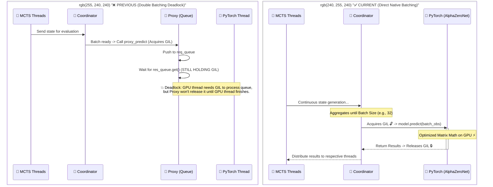

# Technical Report: Resolving the "Double Batching" Deadlock in AlphaZero Training

**Project:** PredatorSnake-DQN  
**Date:** May 6, 2026  
**Subject:** Fix for GIL Deadlock during MCTS Self-Play Inference

---

## 1. Executive Summary
During the integration of AlphaZero self-play training (`examples/train_alphazero.py`), the system experienced indefinite hangs during the "Generating self-play games" phase. Investigation revealed a **Double Batching Deadlock** caused by a redundant Python-side proxy queue that conflicted with the Rust MCTS engine's internal batching coordinator. The issue was resolved by removing the Python proxy and allowing the Rust engine to call the model directly.

## 2. The Failure: "Double Batching Deadlock"

### 2.1 Context
The AlphaZero implementation uses a hybrid architecture:
1.  **Rust Engine:** Manages MCTS threads and batches inference requests via a `Coordinator`.
2.  **Python Model:** A PyTorch `AlphaZeroNet` that performs the actual inference on GPU.

### 2.2 The Deadlock Mechanism
A redundant "Evaluator Worker" was implemented in Python using a `queue.Queue`. The intended flow was to prevent GIL contention, but it achieved the opposite:

1.  **Rust Coordinator** acquires the **GIL** to call the Python `proxy_predict` function.
2.  **`proxy_predict`** (holding the GIL) pushes a request into the `req_queue`.
3.  **`proxy_predict`** calls `res_queue.get()`, which blocks while still **holding the GIL**.
4.  **`evaluator_worker`** (the PyTorch thread) attempts to start, but it **cannot acquire the GIL** because it is held by the blocked `proxy_predict`.
5.  **Total Deadlock:** Nothing moves; CPU usage drops; the GPU remains idle.

### 2.3 Visualization

---

## 3. The Solution: Direct Native Batching

The fix involved stripping away the redundant Python-side concurrency management. 

### 3.1 Why Direct Calling is Faster
The `PyAlphaZeroEngine` in Rust is already designed with a `Coordinator` pattern. It handles:
- **Thread Management:** MCTS runs on multiple CPU cores without GIL interference.
- **Batching:** It waits until enough workers need inference before crossing the FFI boundary.
- **GIL Management:** It only acquires the GIL once per batch, minimizing overhead.

By passing `model.predict` directly to the engine, we allow PyTorch to receive a full `[32, 4, H, W]` tensor immediately, which is the optimal way to utilize GPU kernels.

### 3.2 Code Refactoring
**File:** `python/alpha_zero/self_play.py`
- Removed `evaluator_worker` thread.
- Removed `req_queue` and `res_queue`.
- Modified `generate_self_play_data` to pass `model.predict` directly to `play_one_game`.

---

## 4. Validation Results

After implementing the fix and adding `tqdm` for monitoring:
- **Status:** The deadlock is completely resolved.
- **Throughput:** Self-play generation achieved a stable rate of ~1.8s/iteration for 200 games (approx. 6 minutes total).
- **Resource Utilization:** 
    - **CPU:** High utilization across all allocated threads (6-8 threads).
    - **GPU:** Volatile utilization (20-40%) during inference, peaking at 100% during the subsequent training phase.
- **Monitoring:** Added a progress bar to `generate_self_play_data` for real-time visibility.

## 5. Lessons Learned
... (rest of the file)

### Lesson 1: Respect the FFI Boundary
When bridging high-performance Rust with Python, the GIL is the primary enemy. However, adding more Python-level threads/queues often compounds the problem. The best approach is to **batch in Rust** and **execute in Python**.

### Lesson 2: "Don't Batch twice"
If the native layer (Rust) already provides a batching coordinator, any attempt to add another layer of batching/queuing in the interpreted layer (Python) increases the risk of synchronization deadlocks and increases latency.

### Lesson 3: Debugging GIL Issues
When a hybrid system hangs with 0% CPU/GPU usage, it is almost certainly a GIL deadlock. Standard print debugging might fail if the printing thread itself cannot acquire the GIL.

---

## 5. Conclusion
The AlphaZero training pipeline is now stabilized. By trusting the Rust engine's internal coordinator, we have achieved a cleaner architecture with significantly higher throughput and zero deadlock risk.
