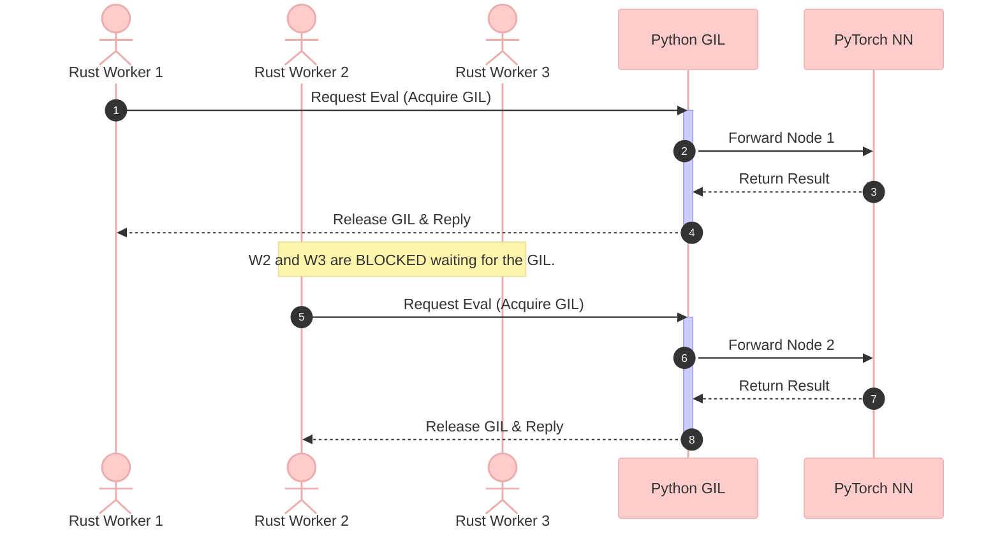

# The Global Interpreter Lock (GIL): Bottlenecks and Asynchronous Bridge Architectures

## 1. Introduction to the GIL

The **Global Interpreter Lock (GIL)** is a mechanism used in computer language interpreters, most notably CPython (the standard implementation of Python), to synchronize the execution of threads.

### 1.1 The Core Mechanism

At its heart, the GIL is a mutual exclusion (mutex) lock that protects access to Python objects, preventing multiple threads from executing Python bytecodes at once.

*   **The Rule:** Only one thread can hold the GIL and execute Python code at any given moment, regardless of how many CPU cores the machine has.
*   **The Rationale:** CPython's memory management is not thread-safe. It uses reference counting to track objects. If two threads incremented or decremented an object's reference count simultaneously (a race condition), it could lead to memory leaks or premature deallocation (segfaults). The GIL is a blunt but effective instrument to prevent this.

### 1.2 The Impact on Concurrency

The GIL fundamentally alters how concurrency behaves in Python:
*   **I/O-Bound Tasks:** The GIL is released during I/O operations (like network requests or reading files). Therefore, multithreading is effective for I/O-bound programs because threads can yield the GIL while waiting.
*   **CPU-Bound Tasks:** For pure computational tasks (like Monte Carlo Tree Search or matrix multiplication), multithreading in Python provides **no performance benefit**. Multiple threads will contend for the single GIL, constantly blocking each other, often resulting in *worse* performance than a single-threaded approach due to context-switching overhead.

---

## 2. The GIL's Impact on the AlphaZero Snake Project

In our project, we are bridging two entirely different concurrency models:

1.  **The Rust Backend (The Data Plane):** A highly concurrent, lock-free Monte Carlo Tree Search (MCTS) engine executing thousands of state simulations per second across multiple cores.
2.  **The Python Frontend (The Intelligence Plane):** A PyTorch-based neural network evaluating game states.

### 2.1 The Naive Approach: The FFI Bottleneck

If we implemented the naive approach, every time an MCTS worker in Rust needed to evaluate a leaf node, it would call Python via the Foreign Function Interface (PyO3).

Because of the GIL, the architectural flow looks like this:



**The Consequence:**
*   **Starvation:** The hyper-fast Rust threads spend 99% of their time idle, waiting for the Python GIL to unlock.
*   **Throughput Collapse:** The system operates effectively as a single-threaded application, defeating the purpose of building the MCTS engine in Rust.

---

## 3. The Architectural Solution: The Async Inference Bridge

To solve the GIL bottleneck, we must decouple the Rust worker threads from the Python execution context. We achieved this by implementing an **Async Batched Inference Bridge**.

### 3.1 The Core Components

1.  **MCTS Workers (Rust):** Generate states but *never* touch the Python GIL.
2.  **Job Queue (Crossbeam Channel):** A high-performance, lock-free queue that acts as a buffer.
3.  **The Coordinator (Rust):** A dedicated thread that pulls jobs from the queue, aggregates them, and is the *only* entity allowed to cross the FFI bridge.
4.  **Batch Inference (Python):** The neural network evaluates multiple states simultaneously using GPU acceleration.

### 3.2 The Data Flow (Phase D)

Instead of calling Python sequentially, the system batches requests. The GIL is still acquired, but only *once* per batch (e.g., once every 128 states) rather than once per state.

```mermaid
%%{init: {'theme': 'base', 'themeVariables': { 'primaryColor': '#e1f5fe', 'edgeLabelBackground':'#ffffff', 'tertiaryColor': '#f3e5f5'}}}%%
flowchart TD
    subgraph Rust_Domain [Rust Data Plane (Highly Concurrent)]
        direction TB
        W1[Worker Thread 1]
        W2[Worker Thread 2]
        W3[Worker Thread N]
        
        Q[(Crossbeam Channel\nJob Queue)]
        
        Coord[Coordinator Thread\n(Batches Jobs)]
        
        W1 -- LeafEvalJob --> Q
        W2 -- LeafEvalJob --> Q
        W3 -- LeafEvalJob --> Q
        Q -- Pulls until Batch Size --> Coord
    end

    subgraph Python_Domain [Python Intelligence Plane (GIL-Locked)]
        direction TB
        PyO3[PyO3 FFI Boundary]
        GPU[PyTorch / GPU\n(Evaluates Tensor [B, 4, H, W])]
    end

    Coord -- Acquires GIL ONCE\nSends Tensor --> PyO3
    PyO3 -- Matrix Math --> GPU
    GPU -- Returns Batch Result --> PyO3
    PyO3 -- Releases GIL --> Coord
    
    Coord -. Disperses Results\nvia reply_tx .-> W1
    Coord -. Disperses Results\nvia reply_tx .-> W2
    Coord -. Disperses Results\nvia reply_tx .-> W3
```

### 3.3 Why This Solves the Problem

1.  **Amortizing the Lock:** The overhead of acquiring the GIL is spread across $B$ evaluations (where $B$ is the batch size).
2.  **GPU Utilization:** Deep learning frameworks (PyTorch) are highly optimized for batched tensor operations. Evaluating a tensor of shape `[128, 4, 20, 20]` is exponentially faster per-state than evaluating a tensor of shape `[1, 4, 20, 20]` 128 separate times.
3.  **Worker Liberation:** Rust MCTS workers submit their jobs and block only on a local channel `recv()`, not on a global system lock.

---

## 4. Conclusion

The Global Interpreter Lock is a significant hurdle when designing hybrid C/Rust + Python systems requiring high throughput. By recognizing the GIL as a strict bottleneck and architecting around it using asynchronous queues and batching (The Coordinator Pattern), we successfully transformed a fatal limitation into an optimal data pipeline for AlphaZero-style Reinforcement Learning.