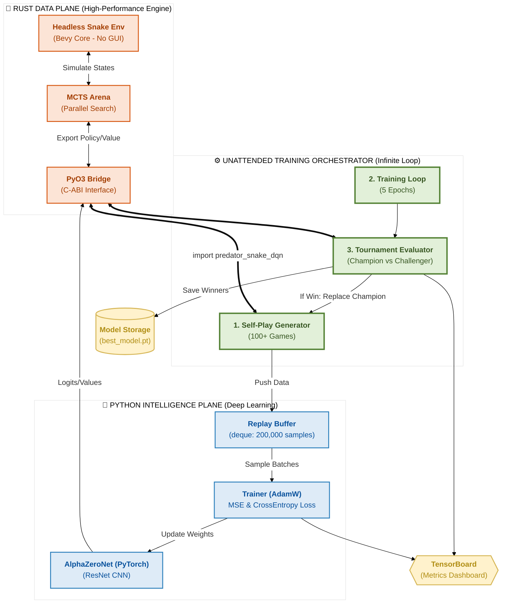

```mermaid
%%{init: {'theme': 'base', 'themeVariables': { 'primaryColor': '#ffffff', 'edgeLabelBackground':'#ffffff'}}}%%
flowchart TD
    classDef rust fill:#fce4d6,stroke:#d85c18,stroke-width:2px,color:#a33d00;
    classDef python fill:#deebf7,stroke:#3182bd,stroke-width:2px,color:#08519c;
    classDef orchestrator fill:#e2f0d9,stroke:#548235,stroke-width:3px,color:#385723;
    classDef storage fill:#fff2cc,stroke:#d6b656,stroke-width:2px,color:#b08d13;

    %% --- RUST DATA PLANE ---
    subgraph Rust ["🦀 RUST DATA PLANE (High-Performance Engine)"]
        direction TB
        BEVY["<b>Headless Snake Env</b><br/>(Bevy Core - No GUI)"]:::rust
        MCTS["<b>MCTS Arena</b><br/>(Parallel Search)"]:::rust
        FFI["<b>PyO3 Bridge</b><br/>(C-ABI Interface)"]:::rust

        BEVY <--> |Simulate States| MCTS
        MCTS <--> |Export Policy/Value| FFI
    end

    %% --- PYTHON INTELLIGENCE PLANE ---
    subgraph Python ["🐍 PYTHON INTELLIGENCE PLANE (Deep Learning)"]
        direction TB
        NN["<b>AlphaZeroNet (PyTorch)</b><br/>(ResNet CNN)"]:::python
        BUFFER["<b>Replay Buffer</b><br/>(deque: 200,000 samples)"]:::python
        TRAINER["<b>Trainer (AdamW)</b><br/>MSE & CrossEntropy Loss"]:::python
        
        NN --> |Logits/Values| FFI
        BUFFER --> |Sample Batches| TRAINER
        TRAINER --> |Update Weights| NN
    end

    %% --- ORCHESTRATOR LOOP ---
    subgraph Loop ["⚙️ UNATTENDED TRAINING ORCHESTRATOR (Infinite Loop)"]
        direction LR
        SP["<b>1. Self-Play Generator</b><br/>(100+ Games)"]:::orchestrator
        TR["<b>2. Training Loop</b><br/>(5 Epochs)"]:::orchestrator
        EVAL["<b>3. Tournament Evaluator</b><br/>(Champion vs Challenger)"]:::orchestrator

        SP --> |Push Data| BUFFER
        TR --> EVAL
        EVAL --> |If Win: Replace Champion| SP
    end

    %% --- STORAGE ---
    CHECKPOINT[("<b>Model Storage</b><br/>(best_model.pt)")]:::storage
    TENSORBOARD{{"<b>TensorBoard</b><br/>(Metrics Dashboard)"}}:::storage

    %% --- CONNECTIONS ---
    FFI <==> |"import predator_snake_dqn"| SP
    FFI <==> EVAL
    EVAL --> |Save Winners| CHECKPOINT
    TRAINER --> TENSORBOARD
    EVAL --> TENSORBOARD
```