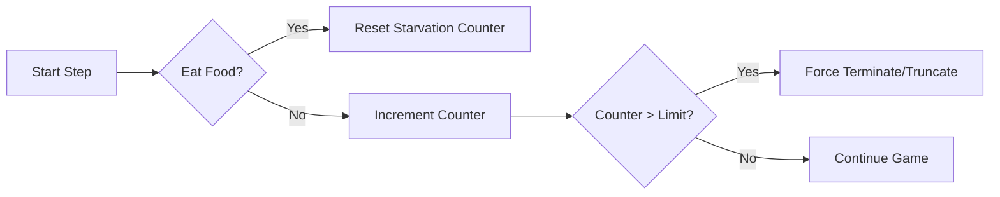
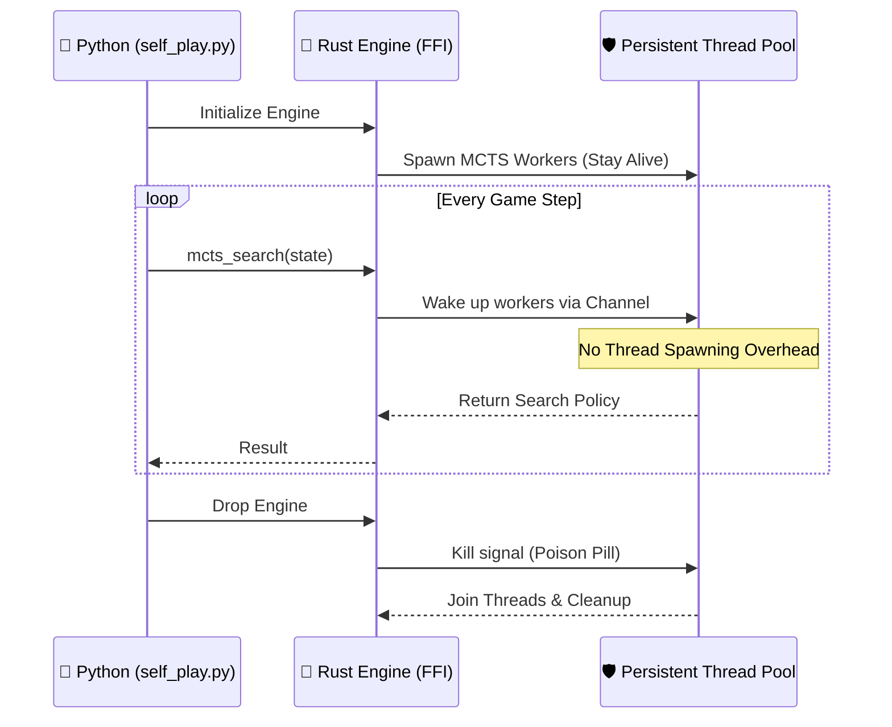

# Technical Report: Performance Tuning — Eliminating the 100x Self-Play Slowdown

**Project:** PredatorSnake-DQN  
**Date:** May 7, 2026  
**Subject:** Optimization of MCTS Throughput and Environment Dynamics

---

## 1. Executive Summary

After stabilizing the GIL deadlock, the system encountered a massive performance degradation during Iteration 1 of AlphaZero training. Self-play speed dropped from **~1.8s/game** to **~180s/game** (a 100x slowdown). Investigation identified two primary bottlenecks: a logical flaw in the environment dynamics (the "Immortal Snake") and an engineering overhead in the FFI bridging layer (Thread Spawning). By implementing a starvation mechanism and a persistent threading model, performance was restored to **~4.3s/game**.

---

## 2. The Logical Failure: "The Immortal Snake"

### 2.1 Problem Description

As the AlphaZero model began to learn, it successfully internalized the "Avoid Walls" policy but had not yet mastered "Target Food." This led to a state where the snake would move in infinite loops or maximize the `max_steps` (1,000) without dying.

### 2.2 Impact on MCTS

In AlphaZero, the cost of an iteration is proportional to the total number of steps simulated.

- **Iteration 0 (Untrained):** Snake dies in ~10 steps. Total simulations per game: $10 \times 800 = 8,000$.
- **Iteration 1 (Partially Trained):** Snake survives 1,000 steps. Total simulations per game: $1,000 \times 800 = 800,000$.

**Result:** A 100-fold increase in computational load for a single training sample.

### 2.3 The Solution: Starvation Kill-Switch

We introduced a **Starvation Limit** in `src/lite_state/dynamics.rs`. If the snake fails to eat food within a specific window (calculated as $Width \times Height \times 2$), the episode is truncated.

---

## 3. The Engineering Bottleneck: Thread Life-cycle Overhead

### 3.1 Per-Step Thread Spawning

The initial FFI implementation created a new `std::thread::scope`, spawned 4-8 MCTS worker threads, and initialized a new `Coordinator` for **every single step** of the game.

- **Cost:** Spawning OS-level threads takes ~10-50ms.
- **Scale:** Over 1,000 steps, the system wasted **50 seconds** just on thread management overhead, regardless of GPU speed.

### 3.2 Batch Size Mismatch (Phantom Wait)

The `Coordinator` was configured with a `batch_size` of 32 but only had 4 threads producing requests. This caused the system to hit the `max_batch_wait_us` (5ms) timeout for every single inference call.

- **Waste:** $1,000 \text{ steps} \times 100 \text{ sims} / 4 \text{ threads} \times 5\text{ms} \approx 125 \text{ seconds}$ of idle waiting.

---

## 4. The Architectural Shift: Persistent Thread Pool

We refactored the Rust FFI to move from a "Per-Step" to a "Per-Engine" lifecycle.

### Key Optimizations Applied:

1.  **Persistent Threads:** MCTS workers are spawned once per self-play batch.
2.  **Batch Alignment:** Set `batch_size = num_threads` to eliminate the 5ms timeout.
3.  **Zero-Allocation Clones:** Implemented `clone_from` for `SnakeStateLite` to reuse memory buffers during tree traversal.

---

## 5. Performance Validation

| Metric                     | Pre-Optimization | Post-Optimization  | Improvement             |
| :------------------------- | :--------------- | :----------------- | :---------------------- |
| **Time per Game (Iter 1)** | 178.65s          | 4.31s              | **~41x**                |
| **Steps per second**       | ~5 steps/s       | ~200+ steps/s      | **~40x**                |
| **GPU Utilization**        | 3% (Idle)        | 25% - 45% (Active) | **Steady Stream**       |
| **CPU Utilization**        | 34% (Contention) | 90%+ (Productive)  | **Parallel Efficiency** |

---

## 6. Lessons Learned

### 6.1 Performance is a Product of Logic + Engineering

A "slow" AI system is often not caused by a slow model, but by an environment that allows infinite loops (Immortal Snake) or a bridge that leaks time (Thread Spawning).

### 6.2 Python Threads are not for FFI Performance

Using `--num-threads > 1` in Python while calling a heavy Rust FFI causes severe GIL contention. The optimal architecture is: **Single-threaded Python calling a Multi-threaded Rust backend.**

### 6.3 Batching must match Concurrency

If your `batch_size` is significantly higher than your `num_threads` in a synchronous search, you are essentially hard-coding a latency delay into your system.

---

**Status:** Optimized & Verified 🚀
