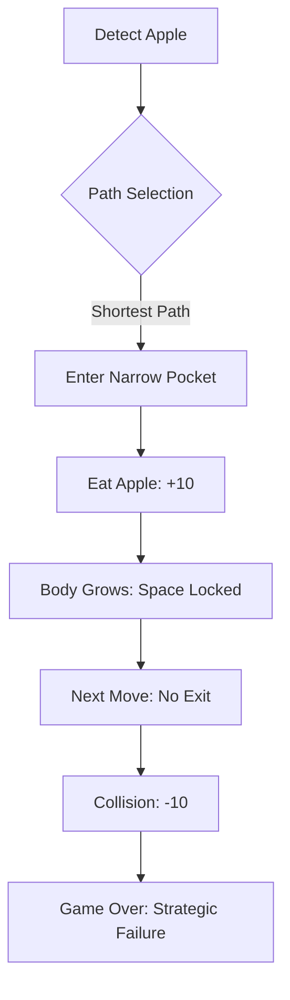
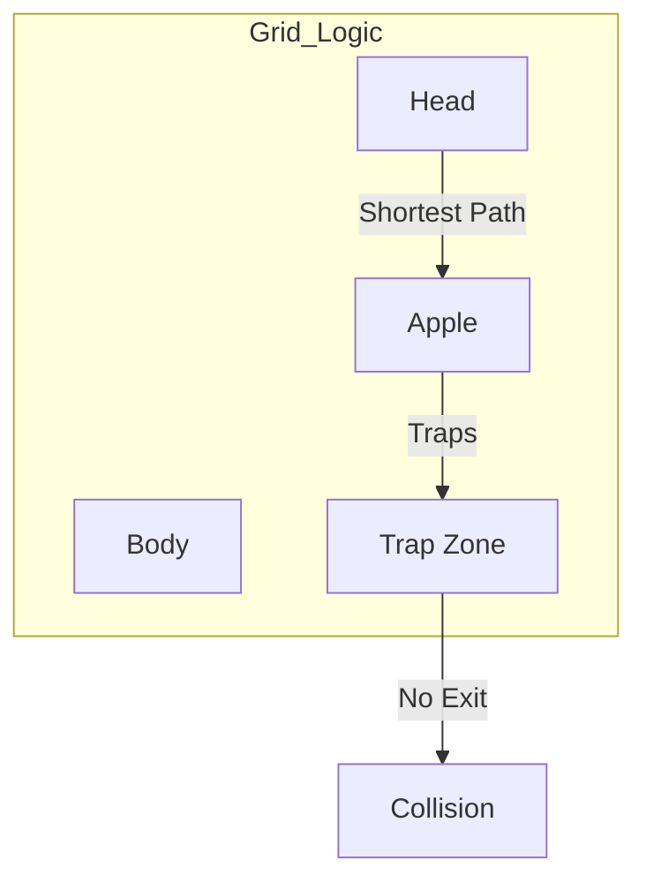

# Technical Report: The "Greedy Trapper" Syndrome in Reinforcement Learning

**Project:** PredatorSnake-DQN  
**Date:** May 6, 2026  
**Subject:** Analysis of Strategic Failure in High-Length Snake Navigation

---

## 1. Executive Summary
The current Reinforcement Learning (RL) implementation for the Snake environment exhibits a classic **Strategic Failure**. While the agent successfully transitions from "lazy survival" to "active foraging," it hits a performance ceiling at approximately **5% map coverage** (Length 20 on a 20x20 grid). This failure is not a bug in the code but a fundamental mismatch between the **Reward Function** and the **Long-term Strategic Objective** (Perfect Game/100% Coverage).

## 2. The Logic Flaw: "The Greedy Trapper"

### 2.1 Reward Conflict
The source code defines the following reward constants in `src/domain/rules.rs`:
*   `REWARD_FOOD`: $+10.0$
*   `REWARD_DEATH`: $-10.0$
*   `REWARD_STEP`: $-0.01$

The agent's logic is mathematically sound but strategically fatal:
1.  **Short-Path Optimization:** To minimize the $-0.01$ step penalty, the AI chooses the **geometrically shortest path** to the apple.
2.  **Immediate Gratification:** The $+10.0$ apple reward is $1000\times$ more powerful than the step penalty. The AI's value function is dominated by the "Eat Apple" event.
3.  **Post-Consumption Blindness:** The AI does not calculate the "Connectivity" of the remaining space *after* the apple is eaten and the body grows.

### 2.2 Visualization of the Failure

## 3. Deep Dive into the "Dead End" Mechanics

### 3.1 The Discount Factor ($\gamma$) Limitation
With $\gamma = 0.99$ (from `examples/train_sb3.py`), the AI's "look-ahead" horizon is mathematically limited. While it sees the whole board, the **Value Propagation** from a future death (20-30 steps away) is significantly diluted compared to the immediate spike of an apple reward.

### 3.2 Topological Ignorance
The CNN extractor (3x3 kernels) is excellent at local feature detection (e.g., "Is there a wall to my left?"). However, it lacks a **Global Topological Understanding**. It does not "see" that a move creates two disconnected sub-graphs of empty space, one of which has no exit.

---

## 4. Extracted Knowledge: Lessons for RL Design

### Lesson 1: Shortest Path $\neq$ Optimal Path
In games with growing spatial constraints (Snake, Tron, Logistics), the shortest path is often a trap. An optimal policy must prioritize **Reachability/Degrees of Freedom** over distance.
*   **Actionable Advice:** Consider adding a "Connectivity Reward" or using Flood-Fill algorithms to penalize moves that reduce the reachable area significantly.

### Lesson 2: The "Hamiltonian" Mindset
To achieve 100% map coverage, the AI must learn to follow a **Hamiltonian Path**—a cycle that visits every node exactly once.
*   **Actionable Advice:** A Perfect Game requires the AI to value "preserving the cycle" more than "eating the apple now."

### Lesson 3: Reward Shaping Hazards
By increasing the apple reward to $+10$, we fixed the "Fear of Moving" (Sống hèn), but created "Greedy Short-sightedness."
*   **Refinement:** Rewards should be **Non-Linear**. The value of an apple should perhaps decrease as the snake gets longer, or the penalty for "Trapped Space" should increase exponentially with body length.

### Lesson 4: State Representation Needs Topology
A raw pixel/one-hot grid is often insufficient for global spatial reasoning.
*   **Actionable Advice:** Feed the AI additional features like:
    *   **Available Area:** Number of reachable cells from the next head position.
    *   **Connectivity Index:** Whether the empty space remains a single connected component.

---

## 5. Proposed Strategic Shift

To move from 5% to 100% coverage, we must redefine the **Success Metric**:

| Phase | Old Logic (Greedy) | New Logic (Strategic) |
| :--- | :--- | :--- |
| **Objective** | Eat apples fast | Occupy space safely |
| **Metric** | Euclidean Distance | Reachable Area (Flood Fill) |
| **Success** | High score quickly | Maximum board filling |
| **Failure** | Dying early | Leaving "holes" in the map |

> **Conclusion:** The AI is currently a "Sprinter" in a "Marathon." It wins the 10-meter dash to the apple only to collapse from exhaustion (lack of space) at the 20-meter mark. To win, it must learn to run slower, taking the "long way around" to ensure the track remains open behind it.
